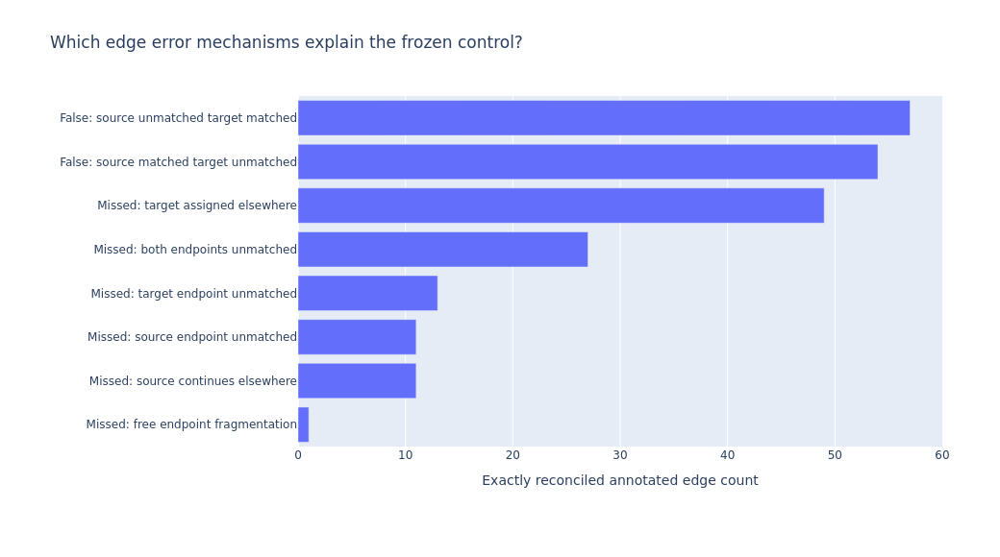

# Case study | Tracking cells under sparse supervision

## The problem

A tracking system must identify cells across time, assign continuations, and represent divisions without introducing invalid lineage relationships. Sparse annotations make validation especially important: absence of an annotation is not automatically evidence that a predicted cell or link is wrong.

## My role

I implemented original representation and association experiments, developed an AWS-centered execution and evidence workflow, reproduced a scored external reference, trained transfer models, and used exact graph evaluation to decide which research directions to continue. Public models, checkpoints, and baseline architecture authors retain credit for their contributions.

## Benchmark first, then test incremental value

The project established an official **0.947** public-score reference. Research candidates were compared against frozen baseline predictions rather than against changing controls. Development metrics, ablations, and diagnostics were kept separate from official competition performance.

An expanded association feature set did not improve tracking decisions over the frozen public probabilities. Subsequent graph, neural-affinity, detector-consensus, and division-focused candidates were promoted only when they improved the full evaluator; otherwise they were rejected.

## Attribute errors before escalating complexity

The exact error analysis separated missed detections from incorrect links between already-detected cells. On five development movies, it reconciled **2,391 correct, 111 incorrect, and 112 missed edges**. Division counts were **one correct, one incorrect, and five missed events**.

Several missed daughter relationships competed with existing assignments, explaining why add-only rules could not solve them.

## Use negative results to make better decisions

Several candidate families were deliberately stopped:

- daughter-retention and temporal reassignment rules had no useful eligible changes;
- competing-parent and neural decoders altered graph structure without improving the measured objective;
- detector localization and gap completion changed predictions but did not recover scored errors;
- detector-informed pruning produced the same tiny gain as a matched equal-count control;
- synthetic graph and image division models achieved strong proxy classification but no exact tracking gain;
- a larger 256-sequence image model changed real candidate rankings without changing the full score;
- sparse-real fine-tuning achieved perfect held-out event AP on a small validation set but still produced **zero** five-movie graph-score gain.

These are not presented as model wins. They demonstrate a measured research process: verify applicability, compare against fixed baselines and matched controls, preserve stronger predictions, and stop unproductive directions.

## Scale supervision, then verify transfer

The project moved from hand-generated synthetic examples to a public fully labelled lineage resource and trained progressively stronger division models.

That work established a useful distinction:

**classification quality on candidate events is not the same as end-to-end tracking quality.**

Synthetic and real-sparse event models could rank plausible division candidates extremely well while failing to correct evaluator-counted graph errors. The full graph metric therefore remained the promotion gate.

## Move upstream when post-processing plateaus

The current frontier changes the modeled object.

Instead of predicting whether one proposed division transaction is good, the new lane targets the actual temporal linker that scores edges between detected cells. The public Biohub baseline provides the architectural starting point: a temporal 3D U-Net supplies image features and a cross-attention transformer scores candidate links between adjacent frames.

The AWS experiment freezes the expensive public visual encoder/detector, caches its outputs, and fine-tunes the linker using sparse real continuation and division edges in multi-frame windows. Held-out validation decides whether the representation is worth evaluating on the retrospective development movies.

This is a broader engineering lesson: when increasingly sophisticated post-processing fails to move the objective, move the learning signal upstream to the component that creates the errors.

## Engineering decisions

Expensive predictions and completed graph evaluations were cached instead of repeatedly regenerated. Data acquisition is resumable and rate-limit aware. Failed experiments preserve diagnostic evidence. Invalid checkpoints are excluded from promotion. Notebook plots remain embedded and readable after reopening.

The public repository remains intentionally separate from working datasets, weights, account settings, and active implementation details.

## Evidence limitations

The five development movies are a retrospective diagnostic cohort from two embryos and have been examined repeatedly. They are useful for controlled engineering comparisons, not independent evidence of generalization.

Sparse real division labels are limited. Some event-level validation sets are small enough to saturate, which is why the project now emphasizes component-level and full-graph validation.

The official 0.947 score is verified. A second image-division probe was accepted by Kaggle and remained pending at the latest returned account check; no improved official score is claimed here.

This document intentionally omits implementation details, parameter settings, feature recipes, and execution instructions.
