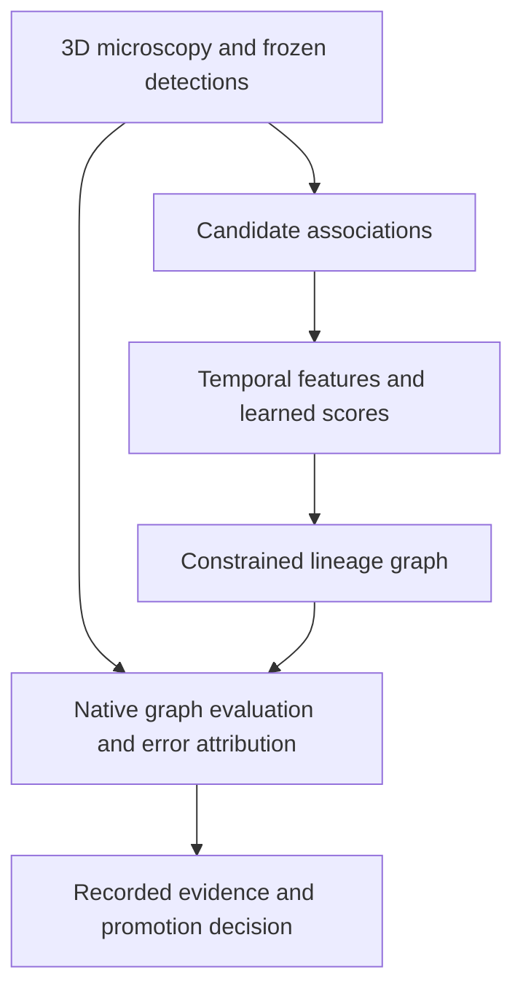
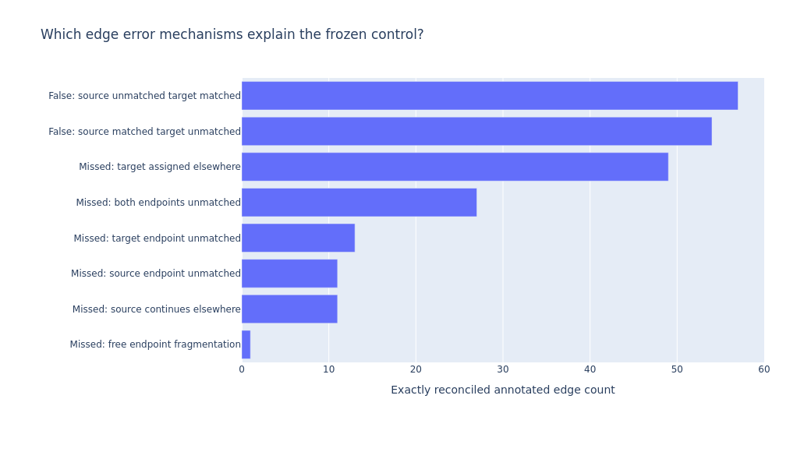

# 3D Cell Tracking & Lineage Graph ML

**Computer vision · temporal modeling · graph optimization · AWS research engineering**

**Alvaro Mendizabal · Machine Learning Engineer** · [GitHub profile](https://github.com/alvaromendizabal)

[](https://github.com/alvaromendizabal/biohub-cell-tracking-during-development/actions/workflows/portfolio.yml)

I built and evaluated a research pipeline for following cells through 3D microscopy sequences and reconstructing their division lineages. Sparse annotations make this difficult: an unlabelled cell is not necessarily a negative, and one incorrect association can change an entire lineage.

My work covers reference reproduction, **557 association features**, temporal and graph models, native-metric error analysis, and resumable AWS execution. Third-party architectures and checkpoints are explicitly attributed. The strongest external result remains the reproduced **0.947** reference; my later candidate scored **0.946** and was rejected.

**Start here:** [Case study](CASE_STUDY.md) · [Runnable lineage example](examples/README.md) · [Executed overview](notebooks/00_portfolio_overview.ipynb) · [Results and limits](RESULTS.md)

**Status:** archived research portfolio. The original Biohub AWS workspace has been removed; the public checks run locally without it. [Archive and reproduction boundary](docs/DECOMMISSION.md)

## 60-second employer review

| Question | Evidence |
|---|---|
| What did I own? | Integration, feature/model research, validation, failure analysis, runtime engineering, and publication |
| What was measured externally? | Reproduced reference **0.947**; later candidate **0.946** |
| What changed locally? | **0.933046 → 0.948059** on five repeatedly inspected movies; this did not transfer to the external evaluation |
| What improved operationally? | Motion-linking component **~34.7×** faster with selected-edge parity; not a whole-pipeline speedup |
| What is preserved? | **45** completed scientific workflows; six executed research notebooks, one executed overview, and a separate presentation notebook |
| What runs from a clone? | Public package tests, authored synthetic graph example, integrity checks, and CSV fidelity/diversity utilities |

## System architecture



Detection, association, and division errors are evaluated separately before accepting an end-to-end change. [Implementation and engineering decisions](docs/ENGINEERING_OVERVIEW.md)

## Selected engineering and research outcomes

| Finding | Decision it supported |
|---|---|
| The candidate improved the local cohort but regressed externally | Retain the reference; stop treating the reused cohort as unbiased validation |
| Fidelity audit found **eight association-edge edits across four movies**, with compared detections and coordinates unchanged | Focus the investigation on association changes rather than broad detector drift |
| Nominally different public outputs were byte-identical | Require measured prediction diversity before designing an ensemble |
| **557** numeric association features did not improve tracking | Preserve the stronger reference instead of promoting added complexity |
| A finite training smoke test was followed by a nonfinite full run | Quarantine invalid weights; do not claim complete organizer-training reproduction |
| Motion-linking timing fell from ~80.5 s to ~2.32 s | Retain the optimization only after output-parity checks |



*Historical project output. See [notebook 28](notebooks/28_exact_tracking_error_budget.ipynb) for the executed error-attribution study.*

## Run the public example

From the repository root in a Python 3.12 environment:

```bash
python -m pip install -r requirements-test.txt -e .
python examples/run_demo.py
python scripts/run_ci.py
```

The example uses authored cells and candidate scores with the real constrained graph solver. It demonstrates lineage constraints and why structural validity alone does not establish biological correctness. It performs no model inference, competition scoring, or cloud action. The [example guide](examples/README.md) includes an executed notebook; [REPRODUCE.md](REPRODUCE.md) describes the full setup and verification path.

## Evidence discipline

- **External scored results:** historical recorded evaluations, not refreshed by this publication.
- **Retrospective development results:** controlled comparisons on a small reused cohort, not independent generalization estimates.
- **Diagnostic evidence:** source/output identity, graph differences, and detection/coordinate fidelity.
- **Engineering evidence:** tests, parity, runtime, packaging, and saved notebook outputs.

Five development movies cover only two embryos, with few annotated divisions and incomplete upstream-training independence. The project does not claim a validated clinical system, production deployment, or an externally improved model. [Model card](docs/MODEL_CARD.md)

## Repository map

| Review goal | Entry point |
|---|---|
| Understand the problem and decisions | [Case study](CASE_STUDY.md) |
| Inspect reusable implementation | [Package](src/biohub_tracking/) and [research modules](research/) |
| Review executed scientific evidence | [Notebook reading guide](notebooks/README.md) |
| Reproduce a small graph decision | [Synthetic example](examples/README.md) |
| Check findings and limitations | [Results](RESULTS.md) and [model card](docs/MODEL_CARD.md) |
| Review engineering and tests | [Engineering overview](docs/ENGINEERING_OVERVIEW.md), [tests](tests/), [CI](.github/workflows/portfolio.yml) |
| Understand reproduction scope | [Reproduction matrix](docs/REPRODUCTION_MATRIX.md) and [public/private boundary](docs/PUBLICATION_SCOPE.md) |

## What is intentionally not published

Private competition inputs, raw microscopy, pretrained weights, private prediction files, tuned thresholds, credentials, cloud locations, large caches/checkpoints, and private orchestration remain excluded. This clone supports inspection and public checks; it does not reproduce the complete private inference workflow or authenticate a historical external score.

Original project contributions and third-party components remain distinct. [Attribution](ATTRIBUTION.md) · [Third-party notices](THIRD_PARTY_NOTICES.md) · [Rights](RIGHTS.md)
