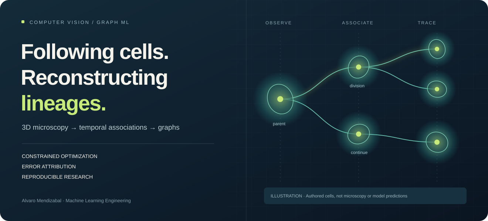
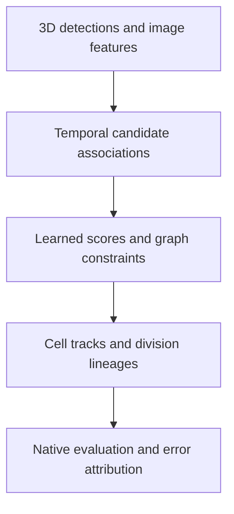

# 3D Cell Tracking & Lineage Graph ML

**Alvaro Mendizabal · Machine Learning Engineer** · [GitHub](https://github.com/alvaromendizabal)

[](https://github.com/alvaromendizabal/biohub-cell-tracking-during-development/actions/workflows/portfolio.yml)



I built and evaluated a system for following cells through 3D microscopy and reconstructing their division lineages. My work combines computer vision, temporal modeling, constrained graph optimization, and recoverable AWS execution.

**The retained system scored 0.947 in historical external evaluation.** I evaluated 557 association features, completed 45 scientific workflows, and accelerated a motion-linking component by **34.7×** with selected-edge parity. A later candidate scored 0.946; I retained the stronger system. A fidelity audit found eight changed association edges with detections and coordinates unchanged.

**Start here:** [Interactive demo](https://alvaro-cell-lineage-explorer.tartmacaw2.chatgpt.site) · [Case study](CASE_STUDY.md) · [Results](RESULTS.md) · [Run locally](REPRODUCE.md)

## 60-second employer review

| What I delivered | Evidence |
|---|---|
| End-to-end research and integration | Detection, temporal association, division modeling, graph evaluation and error analysis |
| A measurable runtime improvement | ~80.5 s → ~2.32 s for motion linking; component benchmark with parity |
| Evidence-based model selection | Local 0.933046 → 0.948059 improvement failed to transfer externally; candidate rejected |
| Runnable public implementation | Synthetic microscopy, candidate construction, constrained graph solving and interactive lineage inspection |
| Recoverable research engineering | Checkpoints, source/output hashes, failure receipts, executed notebooks and CI |

## Try it in three minutes

[Open the public demo](https://alvaro-cell-lineage-explorer.tartmacaw2.chatgpt.site), or open `public-demo/index.html` from a checkout. Scrub through the synthetic cell movie and inspect a cell's ancestry. Change the link-score threshold, child limit or gap-closing policy: the browser recomputes the graph, overlays and exact-ID metrics. Saved Python-solver policies provide comparison points. No account, installation or model download is needed.

To regenerate its inputs and run the checks:

```bash
python -m pip install --require-hashes -r requirements-test.lock
python -m pip install --no-deps --no-build-isolation -e .
python examples/run_tracking_demo.py --output public-demo
python scripts/run_ci.py
```

The demo uses authored synthetic microscopy and known identities. Its exact-ID diagnostics illustrate graph decisions; historical research scores come from separate evaluations. [Setup and verification](REPRODUCE.md)

## System architecture



[Engineering overview](docs/ENGINEERING_OVERVIEW.md) explains the model interfaces, provenance, runtime and testing decisions.

## Selected engineering and research outcomes

The 557-feature expansion did not improve tracking. Nominally different model outputs were byte-identical, so I required measured diversity before ensembling. After the external regression, a fidelity audit found unchanged detections and coordinates but eight changed association edges across four movies. These findings determined which branches to close and which system to retain.

## Evidence discipline

External scores, repeated-cohort development metrics, diagnostic audits and runtime benchmarks are reported separately. Five development movies cover two embryos; repeated inspection and sparse divisions limit generalization claims. [Results and limitations](RESULTS.md)

## Repository map

[Case study](CASE_STUDY.md) · [Implementation](src/biohub_tracking/) · [Executed notebook guide](notebooks/README.md) · [Engineering overview](docs/ENGINEERING_OVERVIEW.md) · [Model card](docs/MODEL_CARD.md) · [Verification guide](REPRODUCE.md)

## What is intentionally not published

The public release contains code, synthetic demos and reviewed evidence. Private microscopy, prediction files, weights, credentials, tuned operational settings and cloud orchestration remain excluded. Historical research and its [archive record](docs/DECOMMISSION.md) are preserved. [Attribution](ATTRIBUTION.md) · [Third-party notices](THIRD_PARTY_NOTICES.md) · [Rights](RIGHTS.md)
