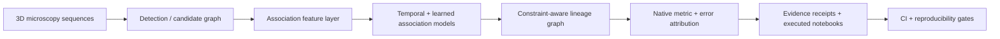

# 3D Cell Tracking & Lineage Graph ML

**Computer vision · temporal modeling · graph learning · reproducible ML systems**

**Alvaro Mendizabal · Machine Learning Engineer** · [GitHub profile](https://github.com/alvaromendizabal)

[](https://github.com/alvaromendizabal/biohub-cell-tracking-during-development/actions/workflows/portfolio.yml)

This portfolio project shows how I approach a difficult ML system end to end: reproduce a trustworthy reference, build new representations, evaluate under sparse supervision, debug validation failures, optimize runtime without changing outputs, and package the work so another engineer can inspect it from a fresh clone.

Given anisotropic 3D microscopy sequences, the system reasons about **cell detections, temporal associations, and division events** to construct lineage graphs while preserving evidence about what was measured, what failed, and why.

## 60-second employer review

| Area | What this project demonstrates |
|---|---|
| ML problem | 3D cell detection, temporal association, lineage reconstruction, sparse supervision |
| Modeling | 3D CNN components, candidate-set transformers, temporal/graph features, association ranking, constraint-aware graph edits |
| Evaluation | Native graph metrics, edge/division error budgets, validation-contamination analysis, prediction-fidelity audits |
| ML systems | AWS-centered GPU research, resumable execution, immutable hashes, failure receipts, notebook verification, CI |
| Scale of research | **557** association features evaluated, **45** completed scientific workflows, **7** executed evidence notebooks |
| Measured engineering result | Parity-checked motion-linking component reduced from ~80.5 s to ~2.32 s — about **34.7×** faster |
| External evidence | A faithfully reproduced reference scored **0.947**; a locally attractive candidate later scored **0.946**, exposing a validation/generalization mismatch |

**Best places to review:** [technical case study](CASE_STUDY.md) · [engineering overview](docs/ENGINEERING_OVERVIEW.md) · [results](RESULTS.md) · [executed notebooks](notebooks/README.md) · [reproduction guide](REPRODUCE.md)

## System architecture



The repository separates **modeling**, **evaluation**, and **evidence** so improvements cannot be accepted solely because an intermediate metric looks better.

## What I built

- an installable `src/biohub_tracking` Python package with reusable evaluation, feature, integration, and model components;
- original temporal, graph, and candidate-set modeling experiments under `research/`;
- a 3D U-Net-style temporal model and candidate-set transformer components;
- sparse-supervision-aware graph evaluation and exact edge/division error accounting;
- source/output fidelity checks that distinguish detector drift from association-only changes;
- experiment receipts, provenance records, and versioned configs;
- seven executed research notebooks plus a presentation notebook;
- CI that validates package integrity, notebooks, publication boundaries, synthetic/unit tests, and evidence tooling from a fresh checkout.

## Selected engineering and research outcomes

| Outcome | Evidence | Why it matters |
|---|---:|---|
| Faithful external reference reproduction | **0.947** scored evaluation | Established a stable control before experimentation |
| Retrospective local graph improvement | **0.933046 → 0.948059** | Demonstrated controlled integration and exact graph accounting |
| Independent external check of that candidate | **0.946** | Revealed that repeated inspection had made the development cohort overly optimistic |
| Association feature study | **557** numeric features | Tested representation breadth before adding model complexity |
| Failure localization | **8** association-edge edits across four movies, with detections/coordinates preserved | Narrowed a regression from “pipeline drift” to association generalization |
| Component optimization | **~34.7×** faster with parity-checked selected edges | Shows performance engineering without silently changing model behavior |
| Research execution | **45** completed scientific workflows | Negative scientific results are retained separately from broken executions |

That 0.946 external result is intentionally visible. It is a stronger engineering signal than hiding an unfavorable experiment: the project changed direction when the evidence contradicted the local metric.

## Evidence discipline

I used four evidence tiers throughout the project:

1. **External scored evidence** — strongest available independent check.
2. **Retrospective development evidence** — useful for controlled comparisons, not treated as clean generalization.
3. **Diagnostic evidence** — source, output, fidelity, and graph-difference audits.
4. **Engineering evidence** — runtime, hashing, packaging, failure-path, and reproducibility tests.

This separation prevented proxy gains, contaminated cohorts, and incomplete runs from being presented as stronger evidence than they were.

## Repository map

| Path | What an employer can review |
|---|---|
| [`src/biohub_tracking/`](src/biohub_tracking/) | Reusable package code, graph evaluation, feature logic, model components, integration utilities |
| [`research/`](research/) | Executable experiment modules and controlled ablations |
| [`notebooks/`](notebooks/) | Executed evidence notebooks and visual portfolio |
| [`tests/`](tests/) | Synthetic/unit coverage for package and publication behavior |
| [`reports/`](reports/) | Compact result, provenance, and run receipts |
| [`configs/`](configs/) | Versioned experiment and feature configuration |
| [`docs/`](docs/) | Engineering overview, model card, experiment ledger, reproducibility notes |
| [`.github/workflows/portfolio.yml`](.github/workflows/portfolio.yml) | Fresh-checkout quality gate |

## Visual evidence


*Saved project output used for graph-level error attribution; the repository also includes the executed notebook that produced the analysis.*

## Reproduce the public project checks

```bash
python -m pip install -r requirements-test.txt
python -m pip install -e .
python scripts/check_showcase.py
python scripts/run_ci.py
```

See [REPRODUCE.md](REPRODUCE.md) for the full fresh-clone workflow and [REPRODUCIBILITY.md](REPRODUCIBILITY.md) for the evidence/data boundary.

## What is intentionally not published

Competition data, third-party pretrained weights, credentials, private AWS state, tuned private thresholds, large cached predictions/checkpoints, and private submission/orchestration machinery are not committed. External assets are referenced by immutable source/version identifiers and checksums where appropriate.

This keeps the repository **inspectable and semi-reproducible without turning it into a dump of private infrastructure or licensed assets**.

## Attribution

Third-party architectures, organizer metric code, public notebooks, and public checkpoints are attributed to their original authors. Original integration, evaluation, feature research, experiment design, failure analysis, packaging, and portfolio engineering are identified as project work.

[Attribution](ATTRIBUTION.md) · [Third-party notices](THIRD_PARTY_NOTICES.md) · [Rights](RIGHTS.md)
