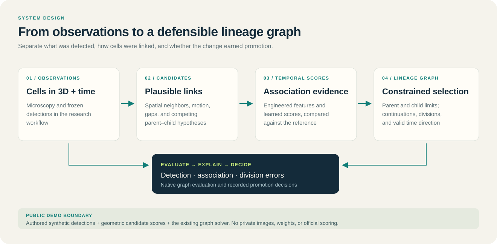

# Engineering overview

## Purpose

This document is the fastest technical review path for engineers and hiring managers who want to understand the system design behind the portfolio without reading every experiment log.

## End-to-end responsibility

The project spans the ML lifecycle rather than a single training script:

**data/provenance → detection → candidate associations → temporal/graph models → lineage constraints → native evaluation → error attribution → evidence packaging → CI**

I owned the integration and research workflow across those layers, while clearly attributing third-party architectures, checkpoints, notebooks, and organizer metric code.

## Modeling surfaces

### Volumetric detection

[`public_reproduction/models.py`](../src/biohub_tracking/public_reproduction/models.py) contains the project-native `TemporalUNet3DReproduction` adaptation. The architecture code is public; it is separate from the third-party pretrained checkpoint used by the retained scored system.

### Candidate-set modeling

The same module contains `SimpleNodeTransformerReproduction` and the combined `UNetNodeTransformerReproduction`. Candidate-set modeling lets associations use context from other candidates. A finite smoke test did not establish stable full training; the separate full attempt became nonfinite.

### Feature and graph research

The package and `research/` modules cover geometric, temporal, graph, association, division, and error-analysis logic. A 557-feature study tested whether representation expansion improved tracking before further increasing model complexity.

## Evaluation architecture

The project deliberately separates four layers of evidence:

1. **Independent scored evidence** — external check of end-to-end behavior.
2. **Retrospective development evidence** — controlled experiments on known cohorts.
3. **Diagnostic evidence** — graph diffs, prediction fidelity, provenance, source/output identity.
4. **Engineering evidence** — tests, runtime, parity, packaging, and failure handling.

This matters because sparse cell annotations and repeatedly inspected embryos can make convenient local metrics look more reliable than they are.

## Error attribution

Instead of treating a metric change as a single opaque outcome, the project decomposes errors into:

- correct / incorrect / missed associations;
- division true positives, false positives, and misses;
- node/detection preservation;
- coordinate stability;
- invalid or excessive forks;
- movie/embryo-level stability;
- exact edge-set differences between candidate graphs.

That decomposition enabled a key regression audit: a candidate that looked stronger locally preserved detections and coordinates but changed only **eight association edges across four movies**. The diagnosis therefore focused on association generalization rather than accidental detector drift.

## Runtime and delivery engineering

The AWS-centered research workflow used:

- bounded GPU/CPU runs;
- resumable caches and checkpoints;
- immutable artifact hashes;
- isolated runtime layers;
- stage-level evidence receipts;
- failure-path packaging;
- persistent notebook outputs;
- source/output/version verification;
- duplicate-action guards.

A parity-checked motion-linking optimization reduced one measured component from about 80.5 seconds to 2.32 seconds, approximately **34.7×**, while preserving selected edges.

## Repository quality gates

The public repository is designed to fail closed on common portfolio problems:

- missing required employer-facing artifacts;
- broken internal Markdown links;
- accidental credentials or private key material;
- vendored model/checkpoint/archive binaries that should not be public;
- unexecuted evidence notebooks;
- corrupted saved PNG outputs;
- syntax-invalid Python;
- drift in core evidence contracts.

GitHub Actions installs the package from a clean checkout and runs the public integrity and synthetic/unit suites.

The [public tracking demo](../examples/run_tracking_demo.py) generates synthetic microscopy, builds association candidates and runs the constrained graph solver across several policies. The [browser demo](https://alvaro-cell-lineage-explorer.tartmacaw2.chatgpt.site) recomputes constrained associations when score thresholds, degree limits or gap settings change, then updates tracks, ancestry and graph errors. Its selected edges match the five Python fixture policies, and 80 small graph cases were checked against exhaustive optima. The subsequent gap-closing pass is evaluated separately from the adjacent-frame degree-constrained optimum. The [five-cell example](../examples/README.md) remains a smaller demonstration of the same constraint mechanism. Optional neural components are not trained by the lightweight CI suite.

## What to inspect in code review

| Review goal | Suggested path |
|---|---|
| Model architecture | [`public_reproduction/models.py`](../src/biohub_tracking/public_reproduction/models.py) |
| Evaluation / sparse supervision | `src/biohub_tracking/annotation_eval.py`, `labeled_eval.py` |
| Feature engineering | `src/biohub_tracking/feature_*` |
| Controlled research modules | `research/` |
| Exact error analysis | `research/exact_error_budget/`, notebook 28 |
| Temporal graph work | `research/temporal_reassignment/`, notebook 27 |
| Test strategy | `tests/`, `scripts/run_ci.py` |
| Provenance / external pins | `reproducibility/external_assets.json`, `reports/source_provenance.json` |
| Portfolio integrity | `scripts/check_showcase.py`, `.github/workflows/portfolio.yml` |

## Engineering principles demonstrated

- Freeze trustworthy controls before experimentation.
- Prefer full-system metrics over proxy-only wins.
- Treat validation independence as a first-class design constraint.
- Keep negative scientific results distinct from failed executions.
- Require parity evidence for performance optimizations.
- Preserve provenance for third-party components and external assets.
- Publish enough for technical review without leaking credentials, licensed data, private infrastructure, or unnecessary tuned implementation details.
