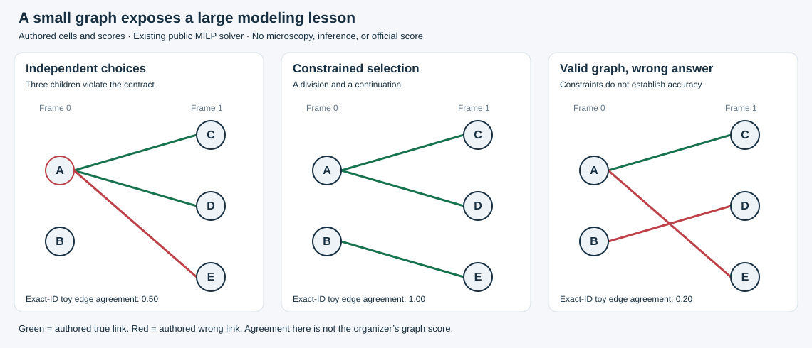

# A five-cell example of lineage reasoning

[Open the executed notebook](lineage_reasoning.ipynb) or run the same selection from a fresh clone:

```bash
python -m pip install -r requirements-test.txt
python examples/run_demo.py
```

This example calls the repository's existing [degree-constrained MILP solver](../src/biohub_tracking/public_graph_methods.py). It needs Python 3.11–3.13, NumPy, pandas, and SciPy. It uses no cloud account, GPU, downloads, model weights, or microscopy data. A normal CPU run takes a few seconds including imports.



The [fixture](fixture.json) was written for this example. Every cell, candidate link, and score is invented. A divides into C and D; B continues as E. Two score sets expose separate failure modes:

| Scenario | Structural result | Exact-ID toy edge agreement | Lesson |
|---|---|---:|---|
| Highest-scoring parent independently for each child | Invalid: A has three children | 0.50 | Local preferences can violate graph constraints. |
| Joint constrained selection | Valid; matches all authored links | 1.00 | Global selection resolves competing links. |
| Joint selection with misleading scores | Valid; two wrong links | 0.20 | A structurally valid graph can still be scientifically wrong. |

The toy check enforces known endpoints, unique edges, consecutive frames, at most one parent, and at most two children. The package solver enforces the degree bounds; the example checks the additional input/topology conditions. These checks do not guarantee real cell identities or division events.

**This is not model inference or a reproduction of the 0.947 external result.** The exact-ID diagnostic assumes known node correspondence and full labels. Real evaluation requires spatial matching, anisotropic coordinates, sparse annotation handling, division-event matching, and the organizer's metric. The full project evidence remains in the [research notebooks](../notebooks/README.md).

The notebook contains real SVG and table outputs captured by executing its cells in order through in-process IPython, then saving and reopening the file. This execution method is also recorded in its metadata; a remote Jupyter kernel execution is not claimed. To rerun it, install `jupyterlab` in the environment above and execute the cells in order. `python examples/run_demo.py --svg examples/lineage_demo.svg` regenerates the standalone illustration. The example introduces no changes to the seven canonical evidence notebooks.
